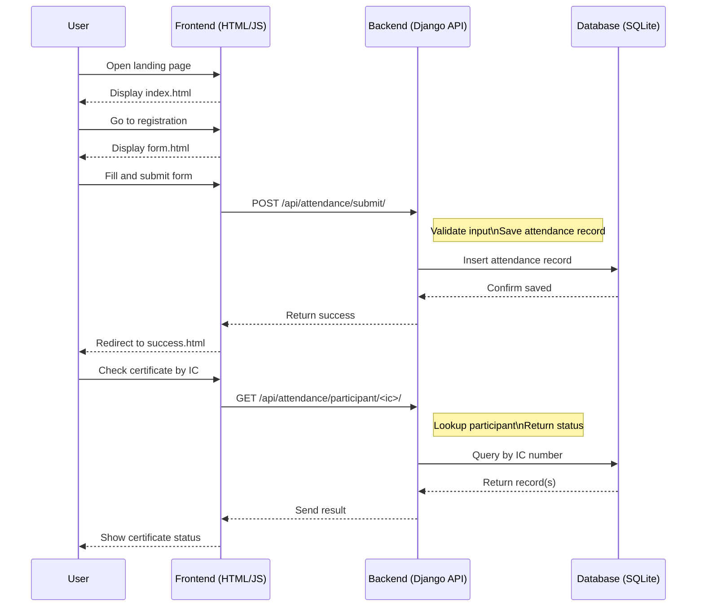

# SPKB Website Sequence Flow

## Overview

This file shows the two separate flows for the SPKB system:
- public client flow
- admin flow

## Public Client Flow



## Admin Flow

```mermaid
sequenceDiagram
    participant Admin
    participant Frontend as Frontend (HTML/JS)
    participant Backend as Backend (Django API)
    participant Database as Database (SQLite)

    Admin->>Frontend: Open admin.html
    Frontend-->>Admin: Display login screen

    Admin->>Frontend: Submit credentials
    Frontend->>Backend: POST /api/attendance/auth/login/
    note right of Backend: Verify admin credentials
    Backend->>Database: Check credentials
    Database-->>Backend: Auth result
    Backend-->>Frontend: Return login response
    Frontend-->>Admin: Show admin dashboard

    Admin->>Frontend: Request records / stats
    Frontend->>Backend: GET /api/attendance/records/ or /api/attendance/stats/
    Backend->>Database: Fetch data
    Database-->>Backend: Return data
    Backend-->>Frontend: Display admin data
    ```